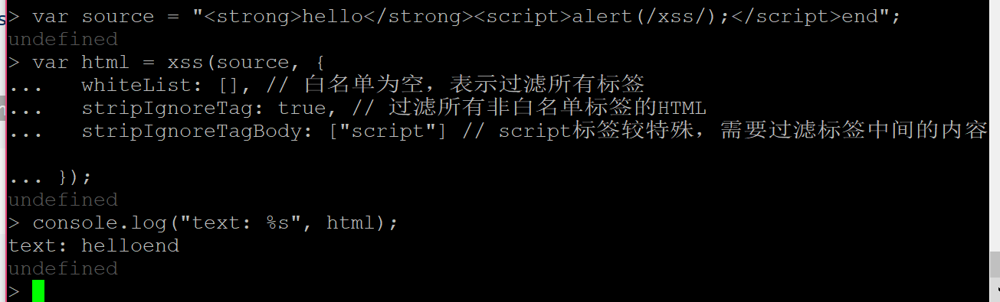

**xss过滤检测**
---
1.概述
根据白名单过滤html，通过防止xss攻击的方式实现漏洞利用检测

2.原理
白名单控制允许的html标签及各标签的属性

    var xss=require("xss"');
	var html = xss('');
	console.log(html);

内置xss命令对输入文件进行过滤处理

	xss -i <源文件> -o <目标文件>
3.自定义

（1）过滤规则

只允许a标签里的href title target，其他都过滤掉
	options = {}; // 自定义规则
	html = xss('', options);

	var options = {
  	 whiteList: {
     a: ["href", "title", "target"]
 	 }
	};

（2）允许标签以data-开头的属性，其他过滤掉

	var source = '
hello
';
	var html = xss(source, {
  	onIgnoreTagAttr: function(tag, name, value, isWhiteAttr) {
    if (name.substr(0, 5) === "data-") {
      // 通过内置的escapeAttrValue函数来对属性值进行转义
      return name + '="' + xss.escapeAttrValue(value) + '"';
    }
 	 }
	});

	console.log("%s\nconvert to:\n%s", source, html);

（3)允许x-开头的标签

	var source = "<x><x-1>he<x-2 checked></x-2>wwww</x-1><a>";
	var html = xss(source, {
  	onIgnoreTag: function(tag, html, options) {
    if (tag.substr(0, 2) === "x-") {
      // 不对其属性列表进行过滤
      return html;
    }
  	}
	});

	console.log("%s\nconvert to:\n%s", source, html);

(5)分析html代码中的图片列表

	var source =
  	'abcd';
	var list = [];
	var html = xss(source, {
  	onTagAttr: function(tag, name, value, isWhiteAttr) {
    if (tag === "img" && name === "src") {
      // 使用内置的friendlyAttrValue函数来对属性值进行转义，可将&lt;这类的实体标记转换成打印字符<
      list.push(xss.friendlyAttrValue(value));
    }
    // 不返回任何值，表示还是按照默认的方法处理
  	}
	});

	console.log("image list:\n%s", list.join(", "));

（6)去掉html标签（只保留文本内容）

	var source = "<strong>hello</strong>end";
	var html = xss(source, {
 	 whiteList: [], // 白名单为空，表示过滤所有标签
  		stripIgnoreTag: true, // 过滤所有非白名单	标签的HTML
  	stripIgnoreTagBody: ["script"] // script标签较特殊，需要过滤标签中间的内容
	});

	console.log("text: %s", html);

4.在web服务器上的实现

	<pre>hello</pre>

	

 	<a href="http://jsxss.com">http</a>
  	<a href="https://jsxss.com">https</a>
  	<a href="ftp://jsxss.com">ftp</a>
    <a href="other1">other1</a>
 	 <a href="/other2">other2</a>
 	 <a href="#">other3</a>
	

	
	<h3>Features:</h3>
	<ul>
 	 <li>只有指定的html标签和属性不会被过滤</li>
  
	</ul>

	

---
参考链接：

[https://github.com/leizongmin/js-xss/blob/master/README.zh.md](https://github.com/leizongmin/js-xss/blob/master/README.zh.md)

